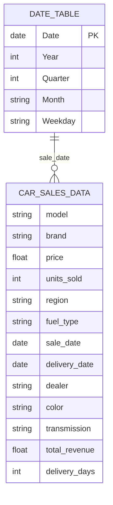

# Car Sales Analytics Project
> *An end-to-end analysis of 150 car dealership transactions to identify what actually drives revenue — volume, price, or product mix — combining Python statistical profiling with an interactive Power BI dashboard.*

---

## ⚙️ Project Type Flags

- [x] Exploratory Data Analysis (EDA)
- [ ] SQL Analysis / Querying
- [x] Dashboard / Data Visualization
- [ ] Data Pipeline / ETL
- [ ] Predictive Modelling / Machine Learning
- [x] Data Cleaning / Wrangling
- [x] End-to-End (multiple of the above)
- [ ] Other: ___________

---

## Table of Contents
1. [Project Overview](#1-project-overview)
2. [Objectives](#2-objectives)
3. [Project Scope & Tools](#3-project-scope--tools)
4. [Repository Structure](#4-repository-structure)
5. [Data Workflow](#5-data-workflow)
6. [Data Model & Schema](#6-data-model--schema)
7. [ERD - Entity Relationship Diagram](#7-erd--entity-relationship-diagram)
8. [Analysis & Metrics](#8-analysis--metrics)
9. [Key Insights](#9-key-insights)
10. [Recommendations](#10-recommendations)
11. [Assumptions & Limitations](#11-assumptions--limitations)
12. [Future Enhancements](#12-future-enhancements)
13. [Deliverables](#13-deliverables)
14. [Author](#14-author)

---

## 1. Project Overview

**Context:** A car dealership network needed clarity on what was actually driving its sales performance across a diverse product line — 8 vehicle models, 5 brands, sold through 5 dealers across 5 regions, in 4 fuel-type categories.

**Problem Statement:** Leadership couldn't tell whether revenue was being driven primarily by sales volume, pricing power, or specific models/regions — and had no reliable way to spot data quality issues, outliers, or delivery bottlenecks hiding in the numbers.

**Approach:** 150 transaction records (Jan–Jun 2024) were profiled and statistically tested in Python (pandas, seaborn, scipy, numpy) — covering data quality checks, distribution analysis, outlier detection, and correlation analysis — then rebuilt as a 3-page interactive Power BI dashboard with custom DAX measures for ongoing business reporting.

**Outcome:** The analysis confirmed sales **volume**, not price, is the dominant revenue driver (0.86 vs. 0.59 correlation with total revenue), surfaced a clean, outlier-free dataset, and identified Crossover C, DriveMax, the Central region, and Electric vehicles as the strongest current performers — translated into 16 prioritized recommendations across inventory, pricing, operations, and marketing.

---

## 2. Objectives

- **Primary Objective:** Determine whether revenue performance across models, brands, and regions is driven more by sales volume or by pricing.
- **Secondary Objective 1:** Assess data quality (missing values, duplicates, outliers) before drawing business conclusions.
- **Secondary Objective 2:** Quantify performance by model, brand, region, fuel type, and dealer to identify top and bottom performers.
- **Secondary Objective 3:** Build a reusable, interactive Power BI dashboard with DAX-driven KPIs for ongoing (not one-off) reporting.

> 💡 *Every analysis decision in this project traces back to one of these objectives.*

---

## 3. Project Scope & Tools

### Scope

| Dimension | Details |
|-----------|---------|
| **In Scope** | 150 car sales transactions across 8 models, 5 brands, 5 regions, 5 dealers, and 4 fuel types. Covers pricing, units sold, revenue, delivery performance, and categorical distributions. |
| **Out of Scope** | Customer demographics, competitor pricing, and marketing spend — none of these fields existed in the source dataset. Predictive/forecasting modelling was also excluded; this phase is descriptive and diagnostic only. |
| **Time Period** | January 2024 – June 2024 (sales dates); deliveries extend through July 4, 2024. |
| **Granularity** | Transaction-level — each row represents one sales transaction (1–20 units per transaction). |

### Tools & Technologies

| Category | Tool(s) Used |
|----------|-------------|
| Data Storage | CSV (`car_sales_data.csv`, enhanced output `car_sales_enhanced.csv`) |
| Data Processing | Python (pandas, numpy) via Google Colab |
| Analysis | pandas, scipy.stats (Z-score outlier testing, correlation), IQR method |
| Visualization | matplotlib, seaborn (Python); Power BI (interactive dashboard) |
| Version Control | Git / GitHub |
| Documentation | Markdown, Word (full project report) |
| Other | Power Query (data transformation within Power BI), DAX (measures & time intelligence) |

---

## 4. Repository Structure

```
Car_Sales_Analytics_Project/
│
├── data/
│   ├── car_sales_data.csv          # Original, unmodified source data
│   └── car_sales_enhanced.csv      # Python-processed dataset (with derived fields)
│
├── notebook/
│   └── car_sales_data_analysis.ipynb   # Google Colab notebook — full analysis workflow
│
├── powerbi/
│    └──  car_sales_dashboard.pbix    # Power BI dashboard file (3 pages)
│   
│
├── reports/
│   └── full_project_report.docx    # Full written report 
│
└── README.md                       # You are here
```

> ⚠️ *No `queries/` folder — this project used Power Query and DAX inside Power BI rather than standalone SQL.*

---

## 5. Data Workflow

```
[car_sales_data.csv]
      ↓
[pandas ingestion via Google Colab]
      ↓
[Cleaning: column standardization, datetime conversion, duplicate/missing check]
      ↓
[Transformation: derived revenue, delivery days, price tier, time features]
      ↓
[Analysis: distributions, outlier detection, correlation, categorical summaries]
      ↓
[Output: enhanced CSV → Power BI model → 3-page dashboard + written report]
```

1. **Source:** `car_sales_data.csv` — 150 rows, 11 columns, exported as a flat CSV covering January–June 2024 sales activity.
2. **Ingestion:** Loaded into a pandas DataFrame in Google Colab (mounted from Google Drive).
3. **Cleaning:** Standardized column names to lowercase/underscore format; converted `sale_date` and `delivery_date` to datetime; confirmed 0 missing values and 0 duplicate rows across all columns.
4. **Transformation:** Derived `total_revenue` (price × units_sold), `delivery_days` (delivery_date − sale_date), time features (`sale_month`, `sale_month_name`, `sale_quarter`), and a 4-tier `price_tier` field (Budget/Mid-Range/Premium/Luxury) via binning.
5. **Analysis:** Descriptive statistics, distribution visualization (histograms/boxplots), categorical breakdowns (brand/region/fuel/model), Z-score and IQR outlier detection, and Pearson correlation analysis.
6. **Output:** An enhanced CSV, an annotated Jupyter/Colab notebook, a 3-page interactive Power BI dashboard, and a full written project report.

---

## 6. Data Model & Schema

### Dataset / Table: `car_sales_data`

| Field Name | Data Type | Description | Example Value |
|------------|-----------|-------------|---------------|
| `model` | string | Vehicle model name (8 unique: SUV A, Crossover C, Sedan X, Convertible V, Pickup Q, Van L, Hatchback Z, Coupe GT) | "SUV A" |
| `brand` | string | Manufacturer brand (5 unique: EcoRide, Speedline, DriveMax, Autostar, UrbanMove) | "DriveMax" |
| `price` | float | Vehicle price in USD | 39639 |
| `units_sold` | int | Units sold in the transaction (1–20) | 9 |
| `region` | string | Sales region (Central, West, East, South, North) | "Central" |
| `fuel_type` | string | Engine/fuel type (Electric, Diesel, Petrol, Hybrid) | "Electric" |
| `sale_date` | date | Date of sale | 2024-03-14 |
| `delivery_date` | date | Date of vehicle delivery | 2024-03-21 |
| `dealer` | string | Selling dealership (AutoHub, City Autos, Prime Motors, Highway Cars, DriveWorld) | "AutoHub" |
| `color` | string | Vehicle color (6 unique) | "Red" |
| `transmission` | string | Gearbox type (Manual, Automatic) | "Manual" |
| `total_revenue` *(derived)* | float | `price × units_sold` | 356751 |
| `delivery_days` *(derived)* | int | `delivery_date − sale_date`, in days | 7 |
| `price_tier` *(derived)* | string | Binned price category — Budget (≤$25K), Mid-Range (≤$40K), Premium (≤$55K), Luxury (>$55K) | "Mid-Range" |

> **Row count:** 150 transactions
> **Date range:** Jan 3, 2024 – Jun 28, 2024 (sales); Jan 15 – Jul 4, 2024 (deliveries)
> **Key relationship:** `car_sales_data[sale_date]` joins to a `DateTable[Date]` dimension for time intelligence in Power BI.

---

## 7. ERD - Entity Relationship Diagram

The Power BI model uses a single fact table joined to a date dimension table (1-to-many) to support clean time intelligence (YTD, MoM growth).



**Table Relationships Summary:**

| Relationship | Join Key | Type |
|-------------|----------|------|
| `DateTable` → `car_sales_data` | `Date` → `sale_date` | One-to-Many |

---

## 8. Analysis & Metrics

### Analytical Approach

This was a descriptive and diagnostic analysis rather than a predictive one: the goal was to profile data quality, characterize distributions, test for outliers, and quantify relationships between price, volume, and revenue — then operationalize the findings into a live Power BI dashboard for ongoing use.

### Key Metrics Defined

| Metric | Plain-Language Definition | Why It Matters |
|--------|--------------------------|----------------|
| `Total Revenue` | Sum of `price × units_sold` across all transactions | The top-line business outcome the whole analysis is oriented around |
| `Revenue per Unit` | Total Revenue ÷ Total Units Sold | Distinguishes whether revenue is driven by volume or by price per unit |
| `Avg Delivery Days` | Average of `delivery_date − sale_date` across transactions | Surfaces operational/logistics performance separate from sales performance |
| `Price–Volume Correlation` | Pearson correlation between `price` and `units_sold` | Tests whether the market is price-sensitive (low correlation = pricing headroom) |

### Methods Used

- Descriptive statistics — distribution, central tendency, and spread for `price` and `units_sold`
- Categorical summaries — total units and revenue grouped by brand, region, fuel type, and model
- Outlier detection — Z-score method (threshold |z| > 3) and IQR method (Q1 − 1.5×IQR / Q3 + 1.5×IQR), cross-validated against each other
- Correlation analysis — Pearson correlation across `price`, `units_sold`, and `total_revenue`
- Power BI DAX measures for time intelligence (YTD, month-over-month growth) and ranking (RANKX on model/brand revenue)

---

## 9. Key Insights

**Insight 1: Volume, not price, drives revenue**
`units_sold` correlates with `total_revenue` at 0.86, versus only 0.59 for `price`. This means growing transaction volume is a more reliable lever for revenue growth than raising prices — and the weak price–volume correlation (0.19) suggests the market isn't especially price-sensitive, leaving room for selective price increases on premium models.

**Insight 2: Crossover C outperforms on price, not volume**
Crossover C generates the highest model revenue ($15.39M) despite SUV A having more transactions (27 vs. fewer for Crossover C). This points to Crossover C commanding a materially higher average selling price rather than simply moving more units — a pricing/positioning strength worth protecting and building on.

**Insight 3: Electric vehicles are the clear category leader**
Electric leads both units sold (451) and revenue ($19.27M) among the four fuel types, ahead of Diesel, Petrol, and Hybrid — signaling a real shift in demand toward electrification rather than a one-off blip.

**Insight 4: The dataset is genuinely clean, which is itself a finding**
Zero missing values, zero duplicate rows, and zero outliers by both Z-score and IQR methods across 150 transactions. This gives confidence that the revenue and regional findings reflect real business dynamics rather than data quality artifacts.

**Insight 5: Regional demand is concentrated, with South underserved**
Central ($14.54M) and East ($13.87M) lead regional revenue, while South trails at $8.57M — less than 60% of Central's figure. This gap is large enough to warrant investigating whether it reflects genuine lower demand or an under-resourced market.

---

## 10. Recommendations

| Priority | Recommendation | Based On | Suggested Owner |
|----------|---------------|----------|-----------------|
| High | Increase Crossover C inventory allocation given its outsized revenue-per-transaction | Insight 2 | Inventory / Procurement |
| High | Expand electric vehicle stock (EcoRide, Speedline EV models) to capitalize on the 30% EV market share | Insight 3 | Inventory / Procurement |
| High | Investigate the South region's smaller market size — targeted marketing vs. supply constraint | Insight 5 | Regional Sales / Marketing |
| Medium | Test selective price increases on premium models (Crossover C, Convertible V), leveraging the weak price-sensitivity finding | Insight 1 | Pricing Strategy |
| Medium | Reduce average delivery time (currently 7.3 days) toward a sub-5-day target by streamlining dealer-to-customer logistics | Section 5.4 (Operational Efficiency) | Operations / Logistics |
| Medium | Benchmark AutoHub's dealer processes and replicate across City Autos, Prime Motors, and DriveWorld | Section 5.4 (Operational Efficiency) | Dealer Operations |
| Low | Add Power BI forecasting to the revenue trend line and set up automated delivery-delay alerts (>10 days) | Section 6.5 (Dashboard Next Steps) | BI / Analytics team |

---

## 11. Assumptions & Limitations

### Assumptions
- The source CSV was treated as complete and accurate as delivered; no validation was performed against an external system of record.
- Price tier boundaries (Budget ≤$25K, Mid-Range ≤$40K, Premium ≤$55K, Luxury >$55K) were adopted as reasonable business segmentation, not derived from an official pricing policy.
- The 150-transaction sample is assumed representative of typical sales activity for the Jan–Jun 2024 window.

### Limitations
- The dataset spans only six months, so seasonal patterns (e.g., Q4 spikes) cannot be assessed — findings should be treated as a snapshot, not a full-year trend.
- No customer demographic data (age, income, gender) was available, so demand drivers can't be tied to buyer segments.
- No competitor pricing data was available, so pricing recommendations are based on internal price–volume relationships only, not competitive positioning.
- With only 150 rows, subgroup breakdowns (e.g., model × region × fuel type) rest on small sample sizes and should be treated directionally rather than as statistically robust.

> *The goal here is pre-emptive Q&A. What would a thoughtful skeptic push back on? Document the answer here, before they ask.*

---

## 12. Future Enhancements

- [ ] Integrate scikit-learn models for sales forecasting using historical trends
- [ ] Connect Power BI to a live database instead of a static CSV for automated refresh
- [ ] Add customer demographic data (age, income, gender) for deeper profiling, if it becomes available
- [ ] Include competitor pricing data for market positioning benchmarks
- [ ] Extend the dataset to 12+ months to detect seasonal patterns
- [ ] Run A/B tests on pricing strategy by region, leveraging the low price-sensitivity finding

---

## 13. Deliverables

| Deliverable | Description | Location |
|-------------|-------------|----------|
| Enhanced dataset | Cleaned CSV with derived fields (`total_revenue`, `delivery_days`, `price_tier`, etc.) | `/data/car_sales_enhanced.csv` |
| Analysis notebook | Full Python/Colab workflow — cleaning, distributions, outliers, correlation | `/python/car_sales_data_analysis.ipynb` |
| Power BI dashboard | 3-page interactive dashboard (Executive Overview, Model & Brand Deep Dive, Dealer & Operational Performance) | `/powerbi/car_sales_dashboard.pbix` |
| Full project report | Complete written report with methodology, findings, and recommendations | `/reports/full_project_report.docx` |

---

## 14. Author

**Ismail Olamide Abdulrazaq (Holarbrain)**
Data & Analytics Professional

- 💼 [holarbrain.github.io](https://holarbrain.github.io)
- 🔗 [github.com/holarbrain](https://github.com/holarbrain)

---

*Last updated: July 2026*
